

  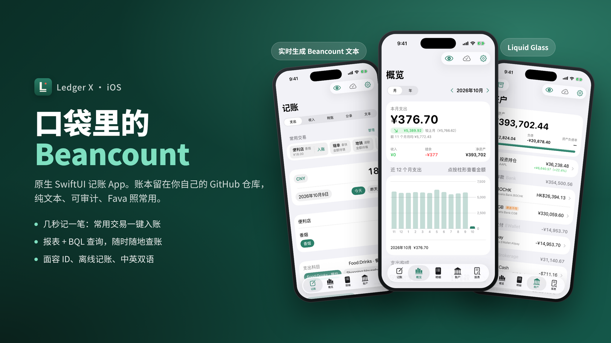

<h1 align="center">Ledger X</h1>

  原生 SwiftUI 的 iOS <a href="https://beancount.github.io">Beancount</a> 记账 / 查账 App 
  账本放在你自己的 GitHub 仓库，手机上记账、对账、看报表、跑 BQL 查询

  
  
  
  

---

## 为什么做它

Beancount 很好用，但它活在电脑上：记一笔要打开编辑器，看报表要启动 Fava。Ledger X 把这两件事搬到手机上，同时 **不改变你的账本**：

- **账本仍是纯文本。** App 通过 GitHub API 直接读写仓库里的 `.bean` 文件，写入格式与手写一致（金额右对齐、按日期插入到正确位置）。电脑上 `git pull` 后，Fava、bean-check、编辑器照常使用。
- **数据只在手机和 GitHub 之间。** 没有服务器、没有账号体系；Token 存在 iOS 钥匙串里。
- **原生、离线可用。** 解析器用 Swift 完整重写，几千笔交易秒开；没网时记的账先排队，联网后自动提交。

## 功能特色

### 记账：几秒钟记完一笔

  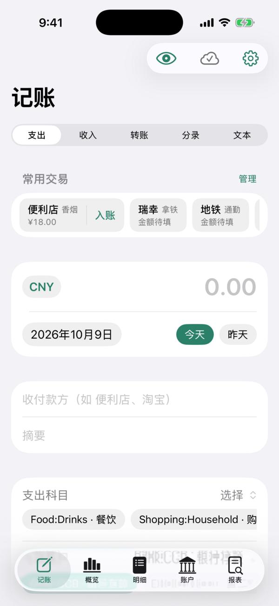
  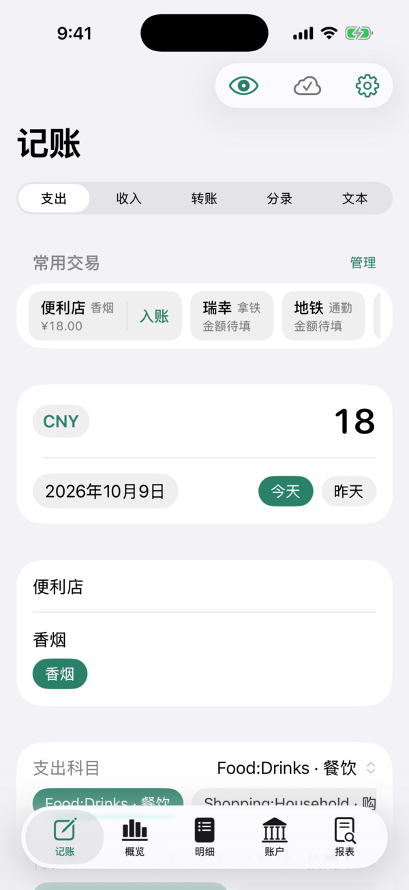
  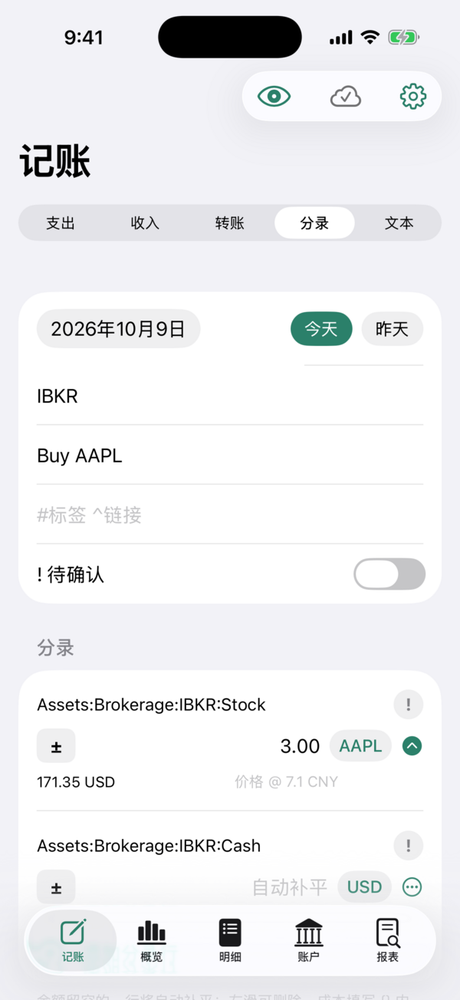
  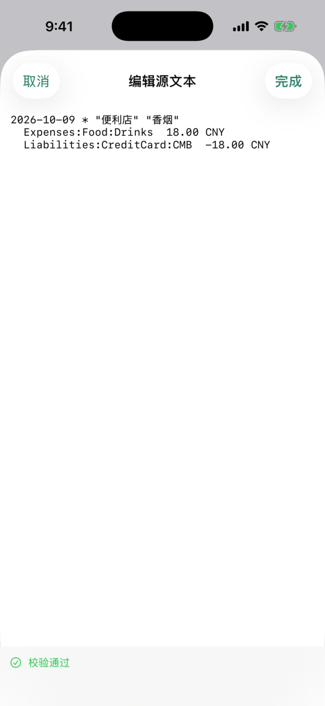

- 支出 / 收入 / 转账 / 多分录 / 直接写 Beancount 文本，五种方式切换
- **常用交易**：自动从近 120 天找出重复出现的交易，固定金额的一键入账，可撤销
- 输入收付款方即联想，自动带出上次用的科目和付款账户
- 金额支持算式（`23.5+12×2`）、外币实付、跨币种转账、信用卡还款、可报销垫款
- 底部实时生成 Beancount 文本，点按可全屏手改，保存前即时校验（平衡、账户是否开立、批次是否足够）

### 概览：一眼看清这个月

  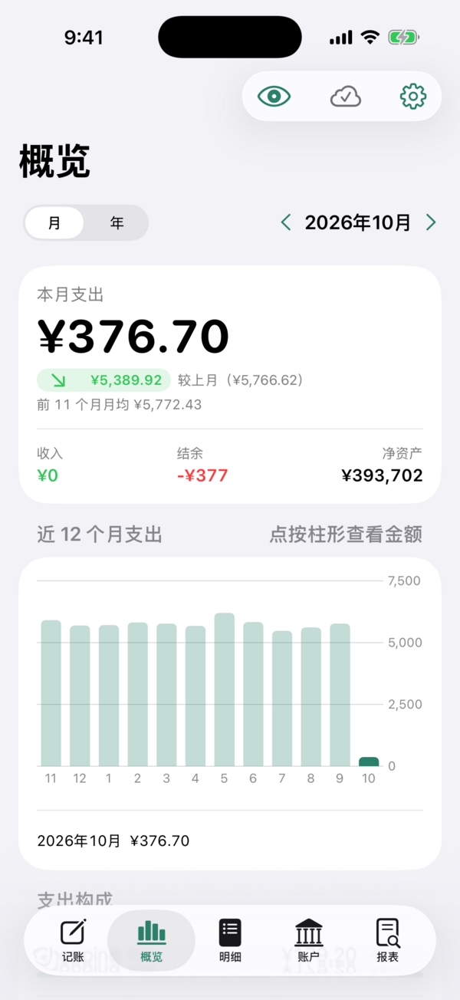
  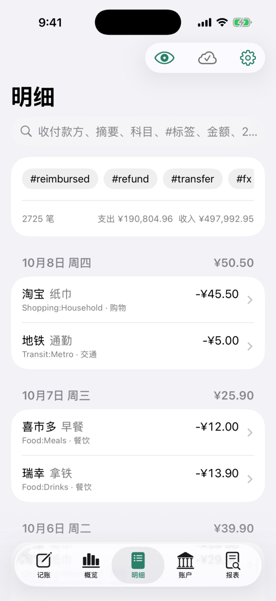
  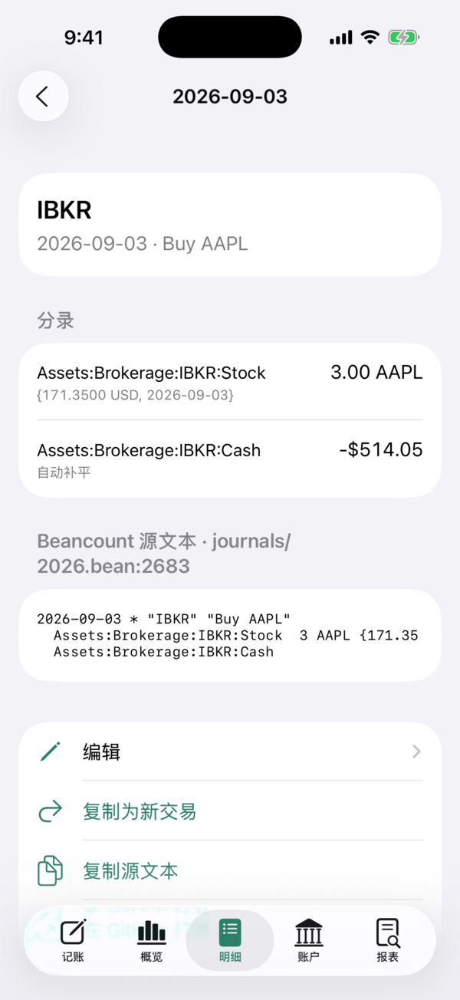
  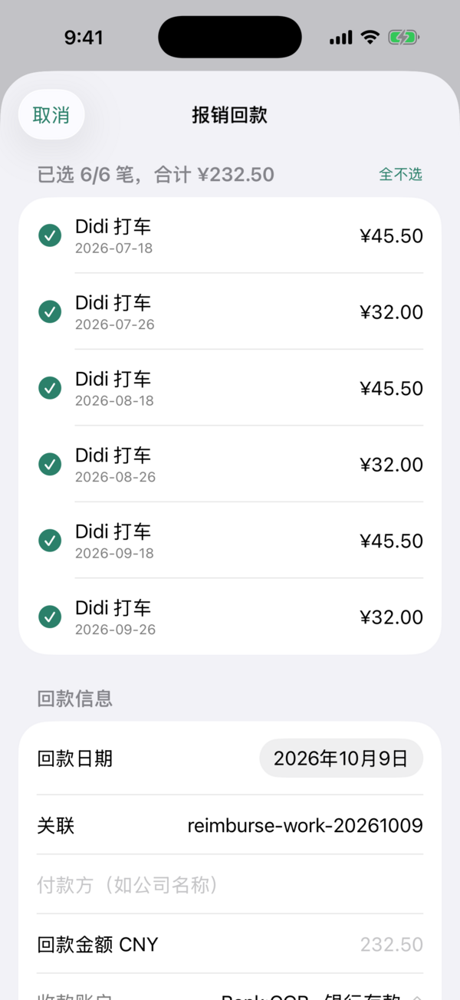

- 月 / 年支出与环比、收入、结余、储蓄率、净资产
- 12 个月柱形图（点按查看金额）、支出构成、商户支出排行、负债、账本校验与 bean-check 结果
- 明细支持组合搜索：收付款方、摘要、科目、`#tag`、`^link`、金额、`>100`、`2026-09`
- 交易详情可编辑源文本、删除、复制为新交易、登记退款
- **报销**：勾选垫付的交易，填写回款金额，自动生成入账交易并打上 `#reimbursed ^link`

### 账户与余额核对

  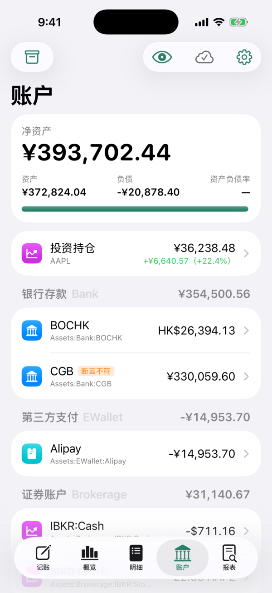
  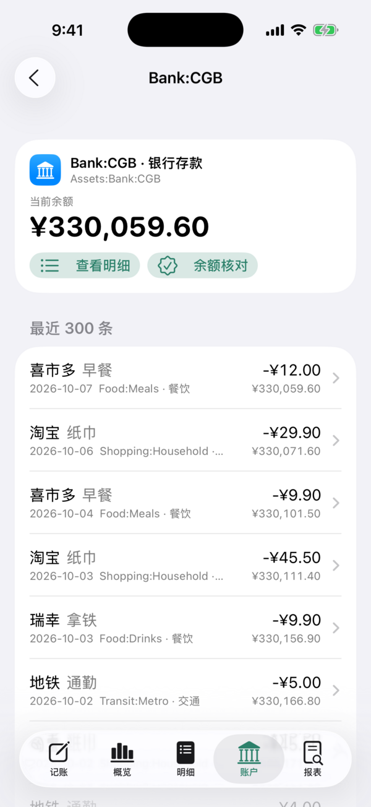
  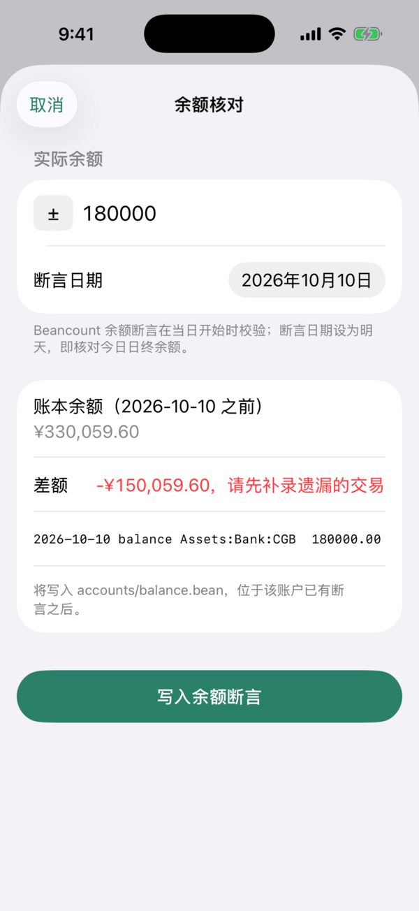
  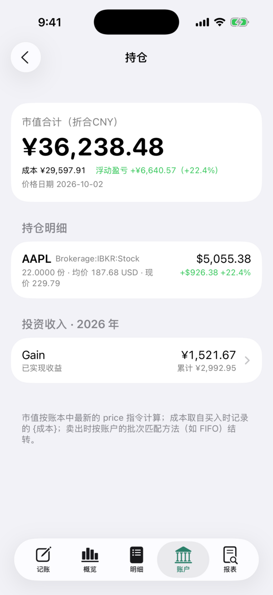

- 净资产卡片 + 资产负债率；账户按类型分组（银行存款、第三方支付、证券、信用卡……），带图标与小计
- 账户明细带滚动余额，余额断言一目了然（相符 / 不符）
- **余额核对**：输入银行 App 里的余额，自动算差额，生成 `balance` 断言；左滑或长按可编辑、删除，编辑会替换原行而不是新增
- 投资持仓：市值、成本、浮动盈亏、每一批次（STRICT / FIFO / LIFO / HIFO / AVERAGE）、投资收益

### 报表与 BQL 查询：口袋里的 Fava

  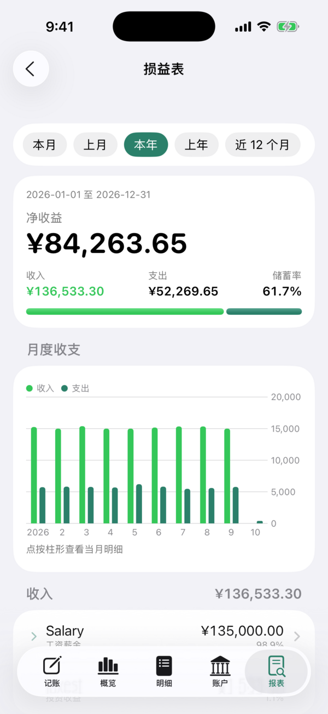
  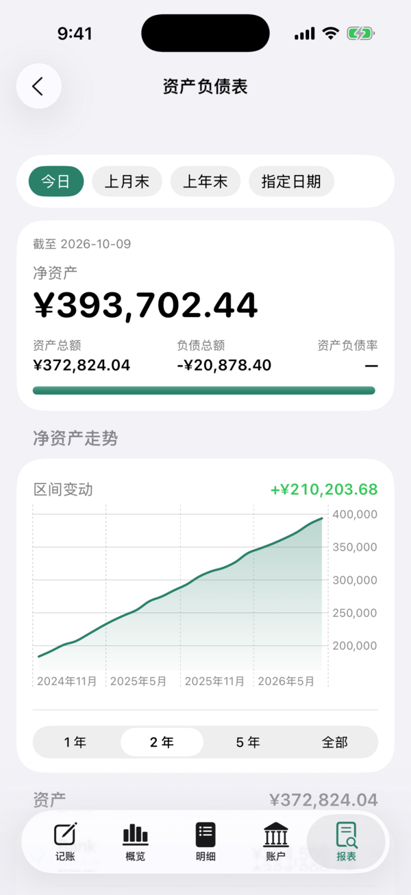
  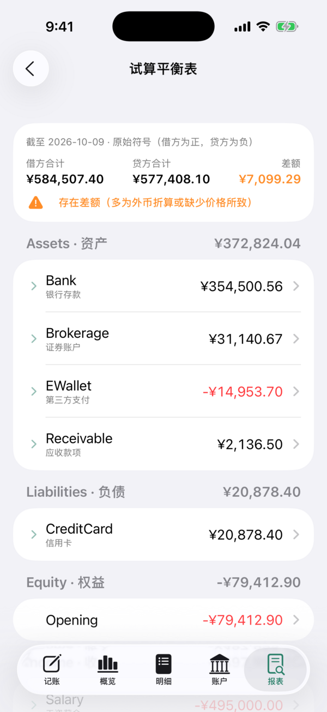
  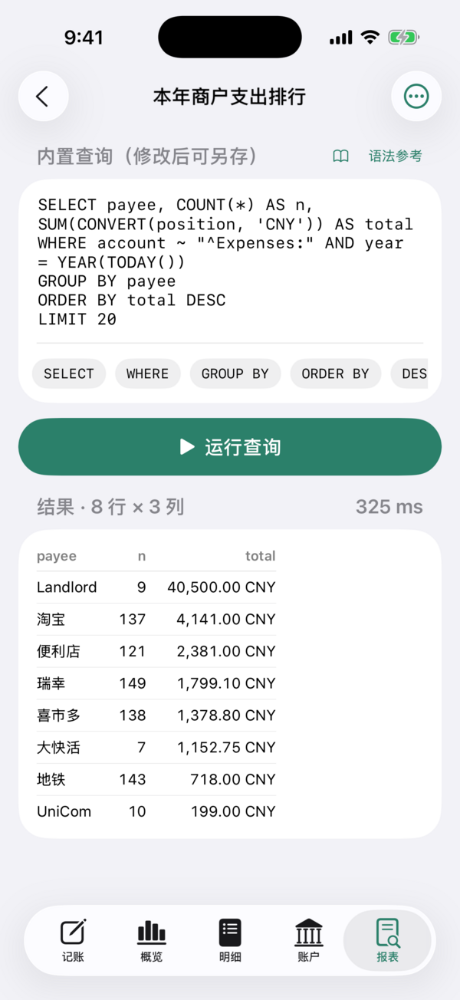

- **损益表**：本月 / 上月 / 本年 / 上年 / 近 12 个月 / 自定义区间，月度收支图，可展开的科目树
- **资产负债表**：任意截止日，净资产走势，未结转损益（与 Fava 一致）
- **试算平衡表**：全部科目余额与借贷平衡校验
- **BQL 查询**：`SELECT … WHERE … GROUP BY … ORDER BY … LIMIT`、`BALANCES`、`JOURNAL`，常用列与函数（`SUM` `CONVERT` `PARENT` `ROOT` `YEAR` `MONTH` …）
  - 内置常用查询；自动列出账本里的 `query` 指令和 `*.bql` 文件
  - 可编辑、运行、保存为「我的查询」，结果可复制或导出 CSV，附语法参考

### 好看，也安全

  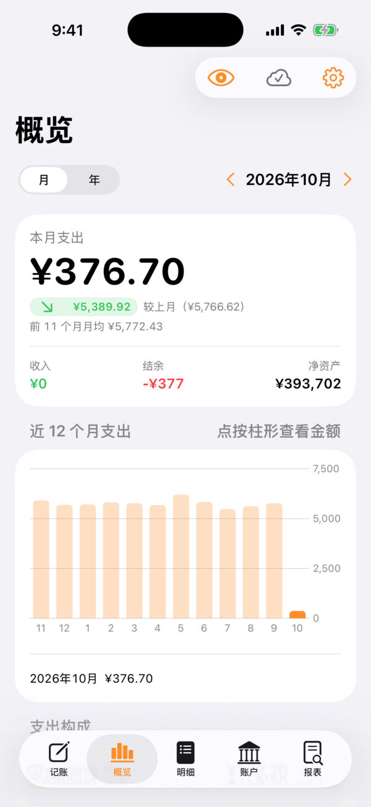
  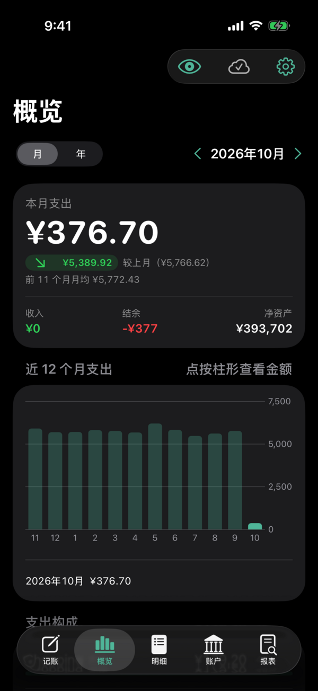
  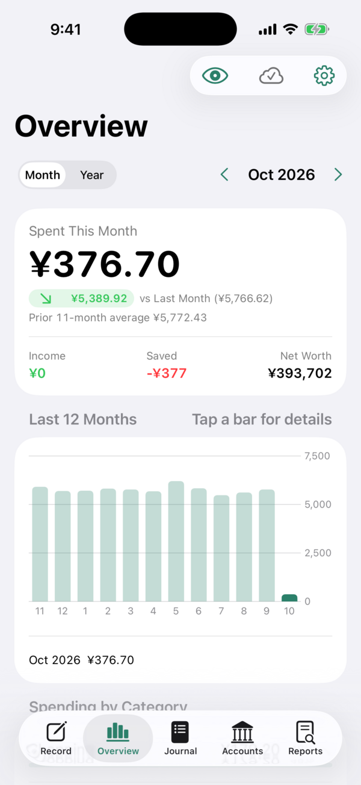
  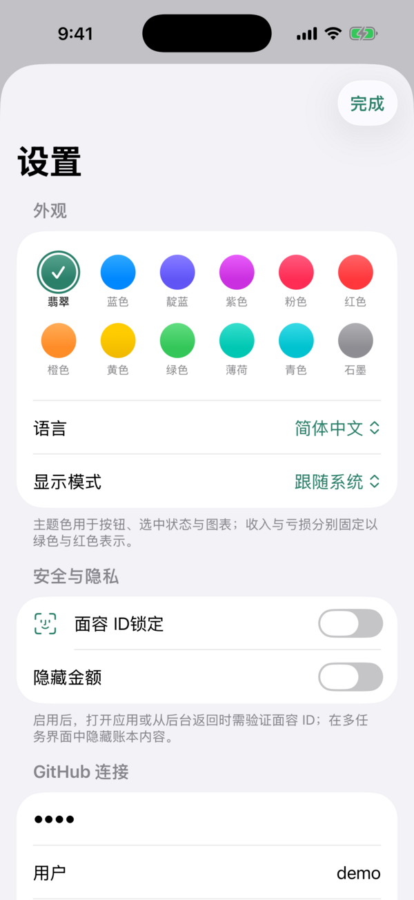

- iOS 26 Liquid Glass 风格；12 种 Apple 系统主题色，浅色 / 深色 / 跟随系统
- **简体中文 / English** 双语界面，可随时切换
- **面容 ID / 触控 ID 锁定**，可设自动锁定时间；多任务界面自动遮挡
- 一键模糊所有金额，适合在人前打开

## 使用方法

### 1. 安装

1. 打开 [Releases](../../releases/latest)，下载最新版的 `Ledger.ipa`。
2. 用 [SideStore](https://sidestore.io) 或 AltStore 导入并签名安装（免费 Apple ID 签名 7 天有效，SideStore 会自动续签）。

> 还没有 Beancount 账本？Fork [ledger-demo](https://github.com/iskerwin/ledger-demo)，用里面约 2000 笔虚构交易先体验全部功能。

### 2. 准备 GitHub Token

在 GitHub → Settings → Developer settings → **Fine-grained tokens** 新建一个：

| 设置 | 值 |
| --- | --- |
| Repository access | 只选你的账本仓库 |
| Contents | **Read and write** |
| Actions（可选） | Read-only，用来显示 bean-check 结果 |

### 3. 连接账本

第一次打开 App，填写 GitHub 用户名、仓库名、分支和 Token，点「连接」。App 会读取主文件（默认 `main.bean`）及其 `include` 的所有文件。

### 4. 不需要改你的仓库结构

App 会自动识别新内容写到哪里：

| 写入的内容 | 位置 |
| --- | --- |
| 交易 | 最近一年交易所在的文件，如 `journals/2026.bean`；跨年时自动新建并在主文件中加 `include` |
| 余额断言、价格、开户 / 关户等 | 账本里放同类指令最多的文件，如 `accounts/balance.bean`、`prices.bean` |

如有不同，可在「设置 → 仓库结构」里指定主文件、交易文件（`{year}` 代表年份）和报销用的应收科目。

### 5. 日常使用小贴士

- **记账**：常用交易点「入账」一步完成；其他交易填金额 → 选科目 → 保存。
- **对账**：账户页 → 某个账户 → 余额核对，填银行 App 里的余额；断言日期默认是明天（Beancount 在当日开始时检查）。
- **查账**：明细页搜索 `^reimburse`、`#travel`、`>500`、`2026-09` 等，可组合。
- **查询**：报表页 → 新建查询，或把常用 BQL 写进仓库的 `queries/*.bql`（`-- 标题` 作为查询名），App 会自动列出。
- **离线**：没网也能记，右上角云朵图标显示待同步数量，联网后自动提交。
- **电脑端**：每次保存都是一次 Git 提交，提交信息写明改了什么；`git pull` 即可同步。

## 开发与构建

| 操作 | 结果 |
| --- | --- |
| 推送到 `main` | 跑测试 → 编译 → 更新预发布版 **dev**（`Ledger.ipa`、测试日志、模拟器截图） |
| 推送 `v*` 标签，如 `git tag v1.2 && git push origin v1.2` | 跑测试 → 编译 → 发布正式版 |

- `LedgerKit/` — Beancount 解析、记账、格式化、BQL 引擎与报表（Swift Package，无 UI，可单独 `swift test`）。支持全部指令、算式、多行字符串、`pushtag` / `pushmeta`、成本与批次、`pad`、自动补平、按精度推断的容差。
- `Ledger/` — App（SwiftUI，iOS 17+）。界面文字以中文为键，英文翻译在 `Ledger/en.json`。
- `project.yml` — XcodeGen 工程：`brew install xcodegen && xcodegen` 后用 Xcode 打开。
- `tools/golden.mjs` — 用 `tools/reference/` 中的 JavaScript 参考实现生成测试账本和标准答案，Swift 解析结果须与之逐项一致。

截图中的数据均为测试用的虚构账本。
